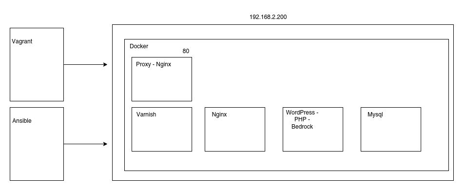

# Development Vagrant + Ansible + Docker + WordPress + Bedrock

Use this repository in development environment.

## Vagrant + docker + docker-compose + WordPress + Bedrock

The purpose of this repository is to establish a development environment incorporating with some docker.

The idea is to emulate a production environment with docker and docker-compose of an application.

## Requirements

- Vagrant ([Install](https://www.vagrantup.com/downloads))
- VirtualBox ([Install](https://www.virtualbox.org/wiki/Downloads))

## Technologies

- Ansible
- Docker
- Docker-compose
- WordPress
- Bedrock

## Config Domain

- vim /etc/hosts

add

```bash
192.168.2.200 ayphu.local
192.168.2.200 pma.ayphu.local
192.168.2.200 correo.ayphu.local
```

## Config Varible Aplications

Rename file `project/.env_example` for `project/.env`

```bash
cp project/.env_example project/.env
```

## Command frequent

- vagrant validate
- vagrant up
- vagrant status
- vagrant suspend NAME
- vagrant resume NAME

## Command optional

- vagrant destroy -f
- vagrant box list
- vagrant box remove NAME
- vagrant ssh master
- vagrant ssh -c "ls -ls" 2>/dev/null

## URL

|  # | URL  | Description  |
|---|---|---|
|  1 | http://ayphu.local/  |  Site principal |
| 2  | http://pma.ayphu.local/  | Manager Mysql  |
| 3  | http://correo.ayphu.local/  |  Mail Manager |

## Diagrams



## Variable important (Vagrantfile)

- VM_IP (IP base)

## Folder

- /project/ - docker-compose with php, mysql

## Document

- Ansible with nginx https://joachim8675309.medium.com/vagrant-provisioning-with-ansible-6dba6bca6290
- Vagrant cli - https://www.vagrantup.com/docs/cli


## By

- Luis Gago Casas (https://luisgagocasas.com)